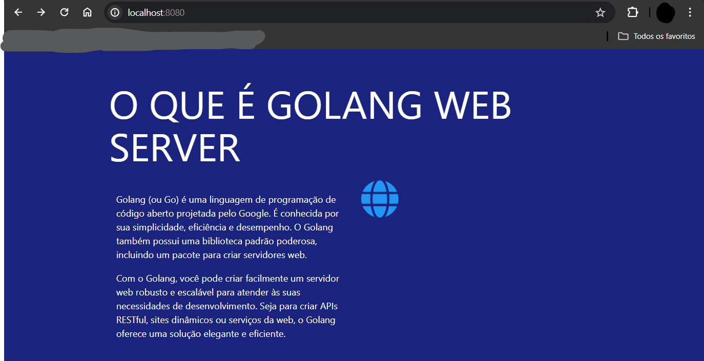
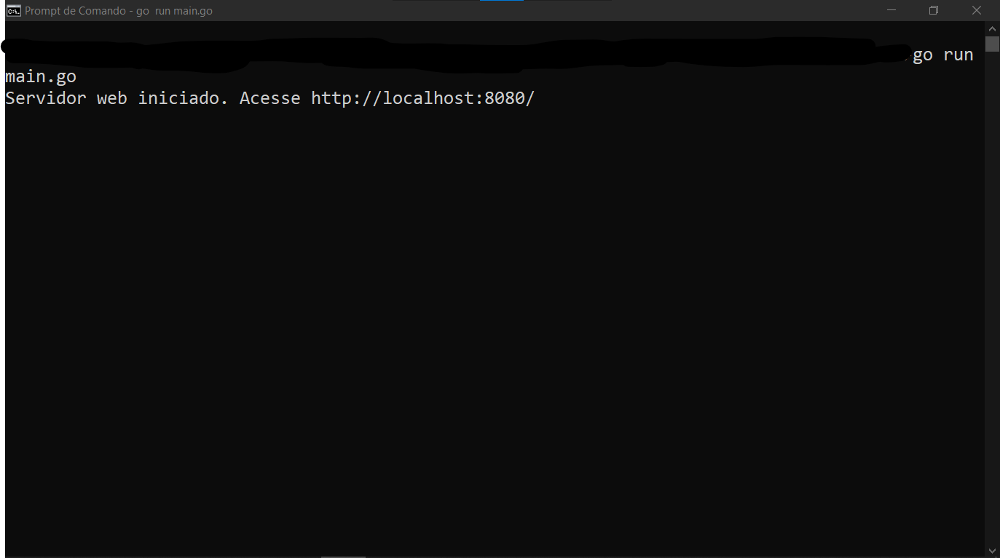

# GOLANG WEB SERVER
🎈VEJA UMA BREVE EXPLICAÇÃO SOBRE O QUE É "GOLANG WEB SERVER". APLICAÇÃO FEITA COM GO/HTML/CSS/MATERIALIZECSS.

 <br>
 <br>

## DESCRIÇÃO:
O aplicativo "O QUE É GOLANG WEB SERVER" é uma página web que fornece uma breve explicação sobre a linguagem de programação Go (Golang) e sua capacidade de criar servidores web. Ele destaca as principais características e benefícios do Go, bem como seu uso para desenvolver servidores web robustos e eficientes.

## FUNCIONALIDADES:
1. **Explicação do Golang:** Oferece uma visão geral sobre a linguagem de programação Go, destacando sua simplicidade, eficiência e desempenho.
2. **Capacidade de criar servidores web:** Destaca a capacidade do Go de criar servidores web escaláveis e eficientes para atender às necessidades de desenvolvimento de APIs RESTful, sites dinâmicos e serviços da web.

## EXECUTANDO O PROJETO:
1. Para iniciar o servidor, execute o arquivo em `./CODIGO/main.go` com um dos seguintes comandos no terminal:
   ```bash
   go run .
   ```
   ou
   ```bash
   go run main.go
   ```

   - Ou se preferir, basta apenas executar `./CODIGO/public/index.html` em um navegador da sua preferência! 😂

2. Após iniciar o servidor, acesse o projeto no navegador utilizando o seguinte URL: [http://localhost:8080/](http://localhost:8080/).

3. Leia a explicação fornecida sobre a linguagem de programação Go (Golang) e sua capacidade de criar servidores web.

4. Se desejar, clique no ícone "GitHub" no canto superior direito para acessar o repositório GitHub relacionado ao "CURSO DE GOLANG".

## NÃO SABE?
- Entendemos que para manipular arquivos em muitas linguagens e tecnologias, é necessário possuir conhecimento nessas áreas. Para auxiliar nesse aprendizado, oferecemos cursos gratuitos disponíveis:
* [CURSO DE GOLANG](https://github.com/VILHALVA/CURSO-DE-GOLANG)
* [CURSO DE HTML E CSS](https://github.com/VILHALVA/CURSO-DE-HTML-E-CSS)
* [CURSO DE MATERIALIZECSS](https://github.com/VILHALVA/CURSO-DE-MATERIALIZECSS)
* [CONFIRA MAIS CURSOS](https://github.com/VILHALVA?tab=repositories&q=+topic:CURSO)

## CREDITOS:
- [PROJETO CRIADO PELO VILHALVA](https://github.com/VILHALVA)

